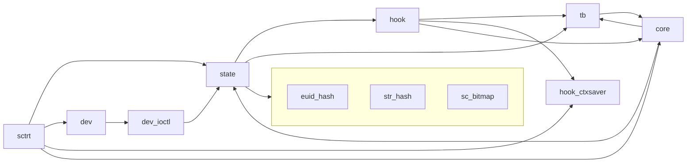

# Architettura

```mermaid
flowchart LR
    %% Subgraph encapsulating the target data structures
    subgraph DS [ ]
        direction TB
        euid_hash[euid_hash]
        str_hash[str_hash]
        sc_bitmap[sc_bitmap]
    end

    %% Core state and logic components
    state_node[state]
    core[core]
    tb[tb]
    hook[hook]
    
    %% Device and IOCTL interfaces
    dev_ioctl[dev_ioctl]
    dev[dev]
    
    %% System Call Table and Hooking Context
    hook_ctxsaver[hook_ctxsaver]
    sctrt[sctrt]

    %% Edge Definitions (State)
    state_node --> DS
    state_node --> hook
    state_node --> tb
    
    %% Edge Definitions (Device IOCTL)
    dev_ioctl --> state_node
    dev --> dev_ioctl
    
    %% Edge Definitions (Hooks)
    hook --> tb
    hook --> hook_ctxsaver
    hook --> core
    
    %% Edge Definitions (Core)
    core --> state_node
    core --> tb
    
    %% Edge Definitions (System Call Table modifications)
    sctrt --> state_node
    sctrt --> dev
    sctrt --> hook_ctxsaver
    sctrt --> core
    
    %% Edge Definitions (Trace Buffer / TB)
    tb --> core
```

## Devices
Per maggiori informazioni, vedere [Documentazione Devices](arch/devices.md)

## Probes

## Services

## Utils

## Tests