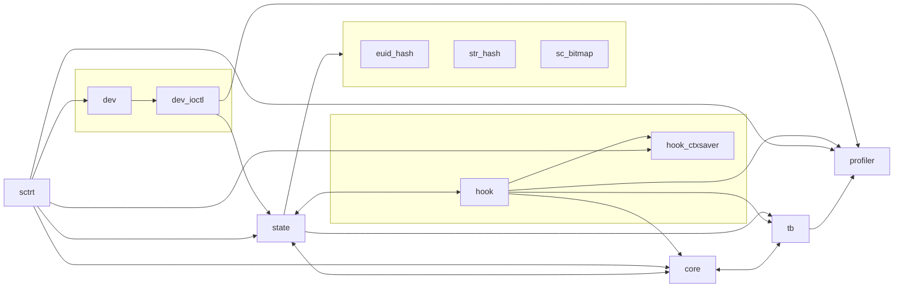

# Architettura

## Core
Per maggiori informazioni, vedere [Documentazione core](arch/core.md)

## Token Bucket
Per maggiori informazioni, vedere [Documentazione Token Bucket](arch/tb.md)

## Probes
Per maggiori informazioni, vedere [Documentazione Probes](arch/probes.md)

## Device
Per maggiori informazioni, vedere [Documentazione Device](arch/devices.md)

## Profiler
Per maggiori informazioni, vedere [Documentazione Profiler](arch/profiler.md)